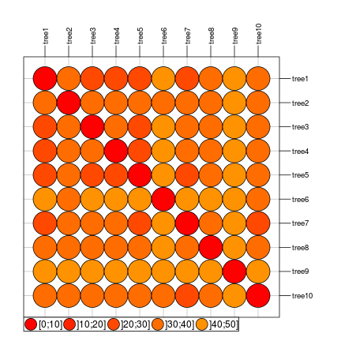

[](https://travis-ci.org/thibautjombart/treescape)


```
## Error in parse(text = x, srcfile = src): <text>:11:32: unexpected '='
## 10: ## plot results
## 11: plotGroves(wm.res$pco, lab=show=
##                                    ^
```


*treescape*: exploration of landscapes of phylogenetic trees
=================================================
*treescape* implements new methods for the exploration and analysis of distributions of phylogenetic trees for a given set of taxa.


Installing *treescape*
-------------
To install the development version from github:

```r
library(devtools)
install_github("thibautjombart/treescape")
```

The stable version can be installed from CRAN using:

```r
install.packages("treescape")
```

Then, to load the package, use:

```r
library("treescape")
```


Content overview
-------------
The main functions implemented in *treescape* are:
* __`treescape`__: explore landscapes of phylogenetic trees
* __`treescapeServer`__: open up an application in a web browser for an interactive exploration of the diversity in a set of trees
* __`findGroves`__: identify clusters of similar trees
* __`plotGroves`__: scatterplot of groups of trees
* __`medTree`__: find geometric median tree(s) to summarise a group of trees

Other functions are central to the computations of distances between trees:
* __`treeVec`__: characterise a tree by a vector
* __`treeDist`__: find the distance between two tree vectors
* __`multiDist`__: find the pairwise distances of a list of trees


Distributed datasets include:
* __`woodmiceTrees`__: illustrative set of 201 trees built using the neighbour-joining and bootstrapping example from the *woodmice* dataset in the *ape* documentation.


Exploring trees with *treescape*
--------------

We first load *treescape*, and packages required for graphics:

```r
library("treescape")
library("ade4")
library("adegenet")
library("adegraphics")
library("ggplot2")
```

The function __`treescape`__ defines typologies of phylogenetic trees using a two-steps approach:
1. perform pairwise comparisons of trees using various (Euclidean) metrics; by default, comparison uses the Kendall and Colijn metric (Kendall & Colijn, submitted) which is described in more detail below; other metrics rely on tips distances implemented in *adephylo* (Jombart *et al.* 2010).
2. use Metric Multidimensional Scaling (MDS, aka Principal Coordinates Analysis, PCoA) to summarise pairwise distances between the trees as well as possible into a few dimensions; output of MDS is typically visualised using scatterplots of the first few Principal Components (PCs); this step relies on the PCoA implemented in *ade4* (Dray & Dufour 2007).

The function `treescape` performs both tasks, returning both the matrix of pairwise tree comparisons (`$D`), and the PCoA (`$pco`).
This can be illustrated using randomly generated trees:

```r
## generate list of trees
x <- rmtree(10, 20)
names(x) <- paste("tree", 1:10, sep = "")

## use treescape
res <- treescape(x, nf=3)
names(res)
```

```
## [1] "D"   "pco"
```

```r
res
```

```
## $D
##        tree1 tree2 tree3 tree4 tree5 tree6 tree7 tree8 tree9
## tree2  34.26                                                
## tree3  27.75 33.02                                          
## tree4  26.50 35.01 24.78                                    
## tree5  31.24 33.20 29.05 32.19                              
## tree6  32.50 34.96 27.53 30.76 31.18                        
## tree7  25.32 34.19 24.88 25.75 32.76 30.81                  
## tree8  43.73 43.22 42.83 44.02 41.88 41.23 45.38            
## tree9  29.17 35.87 27.59 28.27 30.74 31.10 27.50 43.67      
## tree10 25.42 35.04 26.04 25.53 30.98 31.05 26.06 46.26 28.05
## 
## $pco
## Duality diagramm
## class: pco dudi
## $call: dudi.pco(d = D, scannf = is.null(nf), nf = nf)
## 
## $nf: 3 axis-components saved
## $rank: 9
## eigen values: 146.6 74.07 58.56 50.59 42.33 ...
##   vector length mode    content       
## 1 $cw    9      numeric column weights
## 2 $lw    10     numeric row weights   
## 3 $eig   9      numeric eigen values  
## 
##   data.frame nrow ncol content             
## 1 $tab       10   9    modified array      
## 2 $li        10   3    row coordinates     
## 3 $l1        10   3    row normed scores   
## 4 $co        9    3    column coordinates  
## 5 $c1        9    3    column normed scores
## other elements: NULL
```

Pairwise distances can be visualised using *adegraphics*:

```r
## table.image
table.image(res$D, nclass=30)
```

 

```r
## table.value
table.value(res$D, nclass=10)
```

 

```r
## with some customization
table.value(res$D, nclass=5, method="color" , symbol="circle", col=heat.colors(10))
```

 

The best representation of these distances in a 2-dimensional space is given by the first 2 PCs of the MDS.
These can be visualised using *adegraphics*'s function `scatter`:

```r
scatter(res$pco)
```

 
Alternatively, the function `plotGroves` can be used:

```r
plotGroves(res$pco, lab.show=TRUE, lab.cex=1.5)
```

 


`treecsape` can be furthe illustrated using *ape*'s dataset *woodmouse*, from which we built the 201 trees supplied in __`woodmiceTrees`__ using the neighbour-joining and bootstrapping example from the *ape* documentation. 

