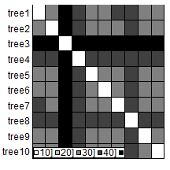
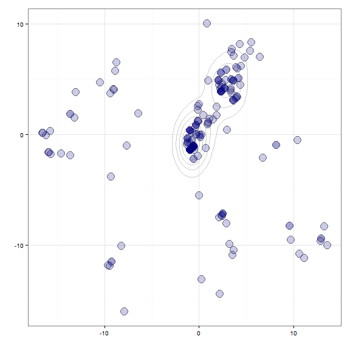
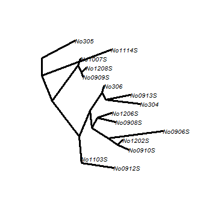

*treescape*: exploration of landscapes of phylogenetic trees
=================================================
*treescape* implements new methods for the exploration and analysis of distributions of phylogenetic trees for a given set of taxa.


Installing *treescape*
-------------
To install the development version from github:

```r
library(devtools)
install_github("thibautjombart/treescape")
```

The stable version can be installed from CRAN using:

```r
install.packages("treescape")
```

Then, to load the package, use:

```r
library("treescape")
```


Content overview
-------------
The main functions implemented in *treescape* are:
* __`treescape`__: explore landscapes of phylogenetic trees
* __`treescapeServer`__: open up an application in a web browser for an interactive exploration of the diversity in a set of trees
* __`findGroves`__: identify clusters of similar trees
* __`plotGroves`__: scatterplot of groups of trees
* __`treeVec`__: characterise a tree by a vector
* __`treeDist`__: find the distance between two tree vectors
* __`multiDist`__: find the pairwise distances of a list of trees
* __`medTree`__: find geometric median tree(s) to summarise a group of trees


Distributed datasets include:
* __`woodmiceTrees`__: illustrative set of 201 trees built using the neighbour-joining and bootstrapping example from the *woodmice* dataset in the *ape* documentation.


Authors / Contributors
--------------
Authors:
* [Thibaut Jombart](https://sites.google.com/site/thibautjombart/)
* [Michelle Kendall](http://www.imperial.ac.uk/people/m.kendall)
* [Jacob Almagro Garcia](http://www.well.ox.ac.uk/jacob-almagro-garcia)

Contributors:
* [Caroline Colijn](http://www.imperial.ac.uk/people/c.colijn)

Maintainer of the CRAN version:
* [Michelle Kendall](http://www.imperial.ac.uk/people/m.kendall)


Exploring trees with *treescape*
--------------

The function __`treescape`__ compares a set of trees and maps them in the 2D plane according to their relative distances from each other. The default comparison uses the Kendall Colijn metric which is described in more detail below.

```r
## generate list of trees
x <- rmtree(10, 20)
names(x) <- paste("tree", 1:10, sep = "")
## use treescape
res <- treescape(x, nf=3)
table.paint(as.matrix(res$D))
```

 

We can visualise these distances in a 2D map:

```r
scatter(res$pco)
```

 

We illustrate this with *ape*'s dataset *woodmouse*, from which we built the 201 trees supplied in __`woodmiceTrees`__ using the neighbour-joining and bootstrapping example from the *ape* documentation. Here we plot the 2D map with *ggplot2*.

```r
data(woodmiceTrees)
woodmiceDists <- treescape(woodmiceTrees,nf=3)
require(ggplot2)
woodmiceplot <- ggplot(woodmiceDists$pco$li, aes(x=A1, y=A2)) # create plot
woodmiceplot + geom_density2d(colour="gray80") + # contour lines
geom_point(size=6, shape=1, colour="gray50") + # grey edges
geom_point(size=6, alpha=0.2, colour="navy") + # transparent blue points
xlab("") + ylab("") + theme_bw(base_family="") # remove axis labels and grey background
```

 

Alternatively, the function __`multiDist`__ simply performs the pairwise comparison of trees and outputs a distance matrix. This function may be preferable for large datasets, and when principal co-ordinate analysis is not required. It includes an option to save memory at the expense of computation time.

The functions __`findGroves`__ and __`plotGroves`__ can be used to identify clusters in the tree landscape

```r
woodmiceGroves <- findGroves(woodmiceTrees, nf=2, nclust=6)
```
and plot them:

```r
## plot results on first 2 axes
PCs <- woodmiceGroves$treescape$pco$li
s.class(PCs, fac=woodmiceGroves$groups, col=funky(6))
```

 

These functions can be explored dynamically using __`treescapeServer`__, where there are further plotting options, clustering methods and ways to save the results of the analysis.


Summarising complex tree spaces
--------------

When a collection of trees contains clusters, a single summary tree may be insufficient to represent the different topologies supported by data. The function __`medTree`__ finds the geometric median tree(s) for a collection of trees by comparing their vectors, for example:


```r
woodmiceMed <- medTree(woodmiceTrees)$median[[1]]
## plot the (first) geometric median tree (there are seven topologically identical median trees):
plot(woodmiceTrees[[woodmiceMed]],type="cladogram",edge.width=3, cex=0.8)
```

 

However, a more complete and accurate summary of the data can be given by finding a summary tree from each cluster. For example, we can isolate the trees from the largest cluster:


```r
wmx <- woodmiceDists$pco$li[,1] # simplifying notation
wmy <- woodmiceDists$pco$li[,2]
wmCluster1 <- woodmiceTrees[intersect(
   intersect(which(wmx>(-2)),which(wmx<2)),
   intersect(which(wmy>(-2.5)),which(wmy<2.5))
   )]
```

and find the geometric median:

```r
geomMedwm1 <- medTree(wmCluster1)$median[[1]]
plot(wmCluster1[[geomMedwm1]],type="cladogram",edge.width=3, cex=0.8)
```

 

This is identical to the overall median tree:

```r
treeDist(woodmiceTrees[[woodmiceMed]],wmCluster1[[geomMedwm1]],1)
```

```
## [1] 0
```

Median trees from other clusters have different topologies, for example:

```r
## isolate the trees from the second largest cluster:
wmCluster2 <- woodmiceTrees[intersect(
 intersect(which(wmx>(-1)),which(wmx<8)),
 intersect(which(wmy>1),which(wmy<6))
)]
## find the geometric median
geomMedwm2 <- medTree(wmCluster2)$median[[1]]
plot(wmCluster2[[geomMedwm2]],type="cladogram",edge.width=3, cex=0.8)
```

 

This is another representative summary tree which is different from those we found above:

```r
treeDist(wmCluster1[[geomMedwm1]],wmCluster2[[geomMedwm2]])
```

```
## [1] 7.28
```

It differs in the placement of the **(1007S,1208S,0909S)** clade. Performing this analysis enables the detection of distinct representative trees supported by data.


Characterising a tree by a vector
--------------
Kendall and Colijn proposed a [metric](http://arxiv.org/abs/1507.05211) for comparing rooted phylogenetic trees. Each tree is characterised by a vector which notes the placement of the most recent common ancestor (MRCA) of each pair of tips. Specifically, it records the distance between the MRCA of a pair of tips $(i,j)$ and the root in two ways: the number of edges $m_{i,j}$, and the path length $M_{i,j}$. It also records the length $p_i$ of each 'pendant' edge between a tip $i$ and its immediate ancestor. This procedure results in two vectors for a tree $T$:
$$ m(T) = (m_{1,2}, m_{1,3},\dots,m_{k-1,k},\underbrace{1,\dots,1}_{k \text{ times}}), \quad
M(T) = (M_{1,2}, M_{1,3},\dots,M_{k-1,k},p_1,\dots,p_k). $$
In $m(T)$ we record the pendant lengths as 1, as each tip is 1 step from its immediate ancestor. 
We combine $m$ and $M$ with a parameter $\lambda \in [0,1]$ to weight the contribution of branch lengths, characterising each tree with a vector $v_{\lambda}(T) = (1-\lambda)m(T) + \lambda M(T)$.

This is implemented as the function __`treeVec`__. For example,

```r
## generate a random tree:
tree <- rtree(6)
## topological vector of mrca distances from root:
treeVec(tree)
```

```
##  [1] 3 1 2 1 0 1 2 1 0 1 2 0 1 0 0 1 1 1 1 1 1
```

```r
## vector of mrca distances from root when lambda=0.5:
treeVec(tree,0.5)
```

```
##  [1] 1.8028 0.5268 1.0436 0.5268 0.0000 0.5268 1.0436 0.5268 0.0000 0.5268
## [11] 1.2096 0.0000 0.5268 0.0000 0.0000 0.9962 0.6364 0.7569 0.6462 0.6405
## [21] 0.6635
```

```r
## vector of mrca distances as a function of lambda:
vecAsFunction <- treeVec(tree,return_lambda_function=TRUE)
## evaluate the vector at lambda=0.5:
vecAsFunction(0.5)
```

```
##  [1] 1.8028 0.5268 1.0436 0.5268 0.0000 0.5268 1.0436 0.5268 0.0000 0.5268
## [11] 1.2096 0.0000 0.5268 0.0000 0.0000 0.9962 0.6364 0.7569 0.6462 0.6405
## [21] 0.6635
```

The metric -- the distance between two trees -- is the Euclidean distance between these vectors:
$$
d_{\lambda}(T_a, T_b) = \| v_{\lambda}(T_a) - v_{\lambda}(T_b)\|.
$$

This can be found using __`treeDist`__:

```r
## generate random trees
tree_a <- rtree(6)
tree_b <- rtree(6)
## topological (lambda=0) distance:
treeDist(tree_a,tree_b) 
```

```
## [1] 5.831
```

```r
## branch-length focused (lambda=1) distance:
treeDist(tree_a,tree_b,1)
```

```
## [1] 2.851
```


